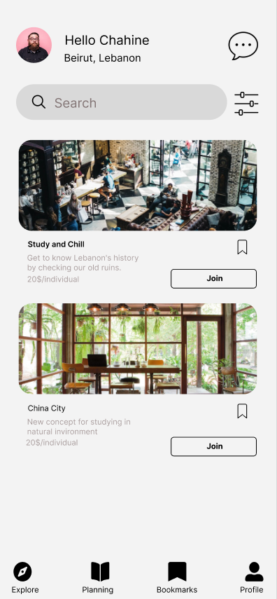

<br><br>

<!-- project philosophy -->


> Roam Rover is a mobile app designed for group adventures and trip planning. It simplifies the decision-making process by leveraging AI for top recommendations.
> Roam Rover aims to facilitate real-time discussions within groups, allowing users to plan outings effortlessly. It provides access to a comprehensive list of places and recommendations, with the added feature of AI-generated trip suggestions.

### User Stories

### User

- As a user, I want to generate a trip based on my budget without the need to search for places and compare budgets.
- As a user, I want to check the locations of recommended or chosen places to make informed decisions.
- As a user, I want to inform my friends about the plan and discuss trip details within the app.

### Admin

- As an admin, I want to have comprehensive access to all announcements and places creation's history.
- As an admin, I want to enhance the app's content by adding new places that users might find interesting.
- As an admin, I want to effectively communicate with users by adding announcements.
  <br><br>

<!-- Tech stack -->


### Roam Rover is built using the following technologies:

- This project uses the [ReactNative app development framework](https://reactnative.dev/). ReactNative is a cross-platform hybrid app development platform which allows us to use a single codebase for apps on mobile, desktop, and the web.
- The app leverages [Redux](https://redux.js.org/) for state management, providing a predictable state container. This ensures efficient data flow throughout the application.
- For persistent storage, the app uses [Async Storage](https://react-native-async-storage.github.io/async-storage/), allowing data to be stored locally on the device.
- This Project uses [Laravel](https://laravel.com/) framework for backend,Laravel serves as a backend framework for PHP web development, offering features and tools that streamline backend processes, such as routing, database management, authentication, and API development, empowering developers to build robust and scalable server-side applications efficiently.
- Our app brings geographical contexts to life using the [Google Maps SDK](https://developers.google.com/maps/documentation). This integration allows us to display detailed maps, complete with interactive markers for each destination.
- To enhance user engagement, our app incorporates the cutting-edge [OpenAI](https://platform.openai.com/docs/introduction) endpoint, leveraging the capabilities of the gpt-3.5-turbo-instruct model. This AI-driven feature provides users with intelligent and personalized trip suggestions, based on their unique preferences and inputs.
  <br><br>
  <!-- UI UX -->
  

> We designed Roam Rover using wireframes and mockups, iterating on the design until we reached the ideal layout for easy navigation and a seamless user experience.

- Project Figma design [figma](https://www.figma.com/file/5CgT0dwIKPiVcGiMI2XmpA/Final-Project?type=design&node-id=8%3A17&mode=design&t=DQpFoX6qTc7XoAGm-1)

### Mockups Examples

| Home Screen                                       | Location Details Screen                                     | AI Questionnaire Screen                                |
| ------------------------------------------------- | ----------------------------------------------------------- | ------------------------------------------------------ |
|  |  |  |

- Check more Mockups on [figma](https://www.figma.com/file/5CgT0dwIKPiVcGiMI2XmpA/Final-Project?type=design&node-id=8%3A17&mode=design&t=DQpFoX6qTc7XoAGm-1)
  <br><br>

<!-- Database Design -->


<br><br>

<!-- Implementation -->


### User Screens (Mobile)

| Onboarding Screens                     | Signin Screen                  | Sign Up Screen                  |
| -------------------------------------- | ------------------------------ | ------------------------------- |
|  |  |  |

| Home Screen                      | Trip Details Screen                        | Room List Screen                     |
| -------------------------------- | ------------------------------------------ | ------------------------------------ |
|  |  |  |

| Chatroom Screen                    | AI Questionnaire Screen                         | Custom Trip Screen                      |
| ---------------------------------- | ----------------------------------------------- | --------------------------------------- |
|  |  |  |

| Bookmark Screen                     | Location Details Screen                          | Map Screen               |
| ----------------------------------- | ------------------------------------------------ | ------------------------ |
|  |  |  |

| Profile Screen                   | Update Profile Screen                          | Loading Screen                   |
| -------------------------------- | ---------------------------------------------- | -------------------------------- |
|  |  |  |

### Videos

<table>
  <tr>
    <td align="center">
      
https://github.com/Chahine-Chahine/RoamRover/assets/138026169/89951657-b387-412f-a428-831865e7237d

</td>
    <td align="center">
      
https://github.com/Chahine-Chahine/RoamRover/assets/138026169/5dd31960-6d5f-4f0f-8971-c8b85b3cd384
</td>
    <td align="center">

https://github.com/Chahine-Chahine/RoamRover/assets/138026169/6d9e0cf9-2d80-45d8-84ed-f97122a823d4

</td>
</table>
### Admin Screens (Web)

| Login Screen                          | Home Screen                            |
| ------------------------------------- | -------------------------------------- |
|  |  |

<br><br>

<!-- Prompt Engineering -->


### Prompt Engineering

- Intelligent Prompt Engineering with OpenAI
  In our cutting-edge application, we leverage the power of OpenAI's advanced natural language processing technology through strategic Prompt Engineering. This approach is at the heart of creating dynamic and contextually relevant interactions with our users.

1. User-Driven Keyword Extraction: The journey begins with a tailored questionnaire presented to our users. As they interact with these questions, their responses are analyzed to extract key phrases and words.

2. Seamless Prompt Formulation: The extracted keywords are then skillfully integrated into a carefully crafted prompt.

3. Context-Aware Responses from AI: Once the prompt, enriched with the user's keywords, is fed into OpenAI's GPT model, the magic happens. The model, renowned for its ability to understand and generate human-like text, processes the input. Drawing from its vast knowledge base and the specific context provided, it generates responses that are not just accurate but also tailored to the user's query.

4. Location and Data Integration: What sets our application apart is how these AI-generated responses are seamlessly integrated with the location-specific data and other relevant information from our app's database.
   <br/>

| OpenAi prompt screen              |
| --------------------------------- |
|  |

<br><br>

<!-- AWS Deployment -->


#### By following these steps, we deployed the backend to Amazon Linux 2023.

Step 1: Update Amazon Linux 2023 Packages

```sh
sudo yum update -y
```

Step 2: Install LAMP Stack

```sh
sudo yum install -y lamp-mariadb10.5-server mariadb php8.0 php8.0-mysqlnd
```

Step 3: Start and Enable Apache and MariaDB Services

```sh
sudo systemctl start httpd
sudo systemctl enable httpd
sudo systemctl start mariadb
sudo systemctl enable mariadb
```

Step 4: Create Database

```sh
mysql -u root -p
CREATE DATABASE laravel;
```

Step 5: Install PHP Composer for Laravel

```sh
curl -sS https://getcomposer.org/installer | php
sudo mv composer.phar /usr/local/bin/composer
```

Step 6: Download Laravel Project

```sh
composer create-project --prefer-dist laravel/laravel laravelApp
```

Step 7: Install Laravel
Navigate to the Laravel directory and install dependencies.

```sh
cd laravelApp
composer install
```

Step 8: Create Laravel Environment Configuration

```sh
cp .env.example .env
php artisan key:generate
```

Step 9: Apache Configuration for Laravel App
Configure your Apache settings to serve the Laravel application

Step 10: Access Laravel Demo Page
Visit your server's public IP address in a web browser.

Step 11: Clone the Repository

```sh
git clone [your-repository-link]
```

Step 12: Download Dependencies

```sh
composer install
```

Step 13: Migrate and Seed the Database

```sh
php artisan migrate --seed
```

Step 14: Serve the Application

```sh
php artisan serve
```

<br><br>

<!-- Unit Testing -->


<br/>


<br><br>

<!-- How to run -->


> To set up Roam Rover locally, follow these steps:

### Prerequisites

1. Install [Node & NPM](https://nodejs.org/en/download).

2. Install [Composer](https://getcomposer.org/download/)

3. Database server: Any Apache HTTP Server, MariaDB database server, recommended [XAMPP](https://www.apachefriends.org/download.html).

### Installation

### Frontend (React Native)

```sh
git clone https://github.com/Chahine-Chahine/RoamRover.git
```

1. Navigate to the frontend directory

```sh
cd frontend
```

2. Install NPM packages

```sh
 npm install npm@latest -g
```

3. Enter your API key in config.js

```sh
 const API_KEY = 'ENTER YOUR API';
```

### Backend (Laravel)

1. Navigate to the backend directory

```sh
cd backend
```

2. Install Composer dependencies

```sh
composer install
```

3. Install Composer dependencies

```sh
composer install
```

4. Generate the application key

```sh
php artisan key:generate
```

5. Download Laravel dependencies

```sh
php artisan migrate
```

### Admin Panel (React)

1. Navigate to the adminPanel directory

```sh
cd adminPanel
```

2. Install NPM packages

```sh
npm install
```

Now, the frontend, backend, and adminPanel of Roam Rover are set up. You can run them locally and explore their features.

Feel free to explore and enjoy using Roam Rover!
