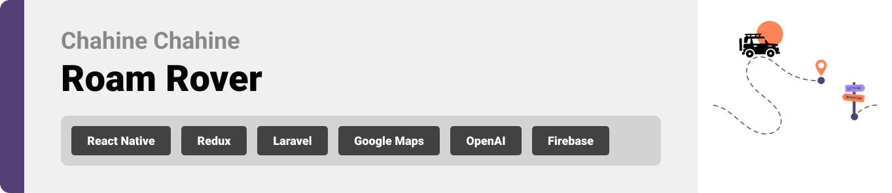

<br><br>

<!-- project philosophy -->


>  Roam Rover is a mobile app designed for group adventures and trip planning. It simplifies the decision-making process by leveraging AI for top recommendations.
> Roam Rover aims to facilitate real-time discussions within groups, allowing users to plan outings effortlessly. It provides access to a comprehensive list of places and recommendations, with the added feature of AI-generated trip suggestions.

### User Stories
- As a user, I want to generate a trip based on my budget without the need to search for places and compare budgets.
- As a user, I want to check the locations of recommended or chosen places to make informed decisions.
- As a user, I want to inform my friends about the plan and discuss trip details within the app.
- As a user, I want a list of good recommendations to choose from manually.
- As a user, I want the app to calculate trip expenses and provide a trip estimated total.
### Admin Stories
- As an admin, I want to have comprehensive access to all user operations for efficient monitoring and assistance.
- As an admin, I want to enhance the app's content by adding new places that users might find interesting.
- As an admin, I want to effectively communicate with users by adding announcements.
<br><br>

<!-- Tech stack -->


###  Roam Rover is built using the following technologies:

- This project uses the [ReactNative app development framework](https://reactnative.dev/). ReactNative is a cross-platform hybrid app development platform which allows us to use a single codebase for apps on mobile, desktop, and the web.
- For persistent storage (database), the app uses the [Hive](https://hivedb.dev/) package which allows the app to create a custom storage schema and save it to a local database.
- To send local push notifications, the app uses the [notifee](https://notifee.app/) package which supports Android, iOS, and macOS.
  - 🚨 Currently, notifications aren't working on macOS. This is a known issue that we are working to resolve!
- The app uses the font ["Work Sans"](https://fonts.google.com/specimen/Work+Sans) as its main font, and the design of the app adheres to the material design guidelines.

<br><br>
<!-- UI UX -->


> We designed Roam Rover using wireframes and mockups, iterating on the design until we reached the ideal layout for easy navigation and a seamless user experience.

- Project Figma design [figma](https://www.figma.com/file/5CgT0dwIKPiVcGiMI2XmpA/Final-Project?type=design&node-id=8%3A17&mode=design&t=DQpFoX6qTc7XoAGm-1)


### Mockups
| Home screen  | Menu Screen | Order Screen |
| ---| ---| ---|
|  |  |  |

<br><br>

<!-- Database Design -->


###  Architecting Data Excellence: Innovative Database Design Strategies:

- Insert ER Diagram here


<br><br>


<!-- Implementation -->


### User Screens (Mobile)
| Login screen  | Register screen | Landing screen | Loading screen |
| ---| ---| ---| ---|
|  |  |  |  |
| Home screen  | Menu Screen | Order Screen | Checkout Screen |
|  |  |  |  |

### Admin Screens (Web)
| Login screen  | Register screen |  Landing screen |
| ---| ---| ---|
|  |  |  |
| Home screen  | Menu Screen | Order Screen |
|  |  |  |

<br><br>


<!-- Prompt Engineering -->


###  Mastering AI Interaction: Unveiling the Power of Prompt Engineering:

- This project uses advanced prompt engineering techniques to optimize the interaction with natural language processing models. By skillfully crafting input instructions, we tailor the behavior of the models to achieve precise and efficient language understanding and generation for various tasks and preferences.

<br><br>

<!-- AWS Deployment -->


###  Efficient AI Deployment: Unleashing the Potential with AWS Integration:

- This project leverages AWS deployment strategies to seamlessly integrate and deploy natural language processing models. With a focus on scalability, reliability, and performance, we ensure that AI applications powered by these models deliver robust and responsive solutions for diverse use cases.

<br><br>

<!-- Unit Testing -->


###  Precision in Development: Harnessing the Power of Unit Testing:

- This project employs rigorous unit testing methodologies to ensure the reliability and accuracy of code components. By systematically evaluating individual units of the software, we guarantee a robust foundation, identifying and addressing potential issues early in the development process.

<br><br>


<!-- How to run -->


> To set up Roam Rover locally, follow these steps:

### Prerequisites

This is an example of how to list things you need to use the software and how to install them.
* npm
  ```sh
  npm install npm@latest -g
  ```

### Installation

_Below is an example of how you can instruct your audience on installing and setting up your app. This template doesn't rely on any external dependencies or services._

1. Get a free API Key at [https://example.com](https://example.com)
2. Clone the repo
   ```sh
   git clone https://github.com/Chahine-Chahine/RoamRover.git
   ```
3. Install NPM packages
   ```sh
   npm install
   ```
4. Enter your API in `config.js`
   ```js
   const API_KEY = 'ENTER YOUR API';
   ```

Now, you should be able to run Roam Rover locally and explore its features.