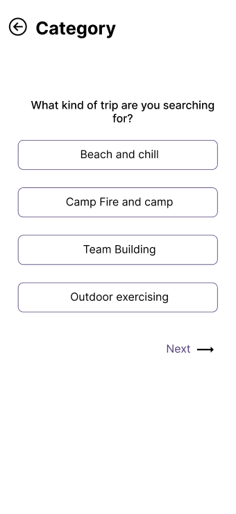

<br><br>

<!-- project philosophy -->


>  Roam Rover is a mobile app designed for group adventures and trip planning. It simplifies the decision-making process by leveraging AI for top recommendations.
> Roam Rover aims to facilitate real-time discussions within groups, allowing users to plan outings effortlessly. It provides access to a comprehensive list of places and recommendations, with the added feature of AI-generated trip suggestions.
### User Stories
### User 
- As a user, I want to generate a trip based on my budget without the need to search for places and compare budgets.
- As a user, I want to check the locations of recommended or chosen places to make informed decisions.
- As a user, I want to inform my friends about the plan and discuss trip details within the app.
### Admin
- As an admin, I want to have comprehensive access to all announcements and places creation's history.
- As an admin, I want to enhance the app's content by adding new places that users might find interesting.
- As an admin, I want to effectively communicate with users by adding announcements.
<br><br>

<!-- Tech stack -->


###  Roam Rover is built using the following technologies:

- This project uses the [ReactNative app development framework](https://reactnative.dev/). ReactNative is a cross-platform hybrid app development platform which allows us to use a single codebase for apps on mobile, desktop, and the web.
- The app leverages [Redux](https://redux.js.org/) for state management, providing a predictable state container. This ensures efficient data flow throughout the application.
- For persistent storage, the app uses [Async Storage](https://react-native-async-storage.github.io/async-storage/), allowing data to be stored locally on the device.

<br><br>
<!-- UI UX -->


> We designed Roam Rover using wireframes and mockups, iterating on the design until we reached the ideal layout for easy navigation and a seamless user experience.

- Project Figma design [figma](https://www.figma.com/file/5CgT0dwIKPiVcGiMI2XmpA/Final-Project?type=design&node-id=8%3A17&mode=design&t=DQpFoX6qTc7XoAGm-1)


### Mockups
| Home screen  | Location Details Screen | AI Questionnaire Screen |
| ---| ---| ---|
|  |  |  |

<br><br>

<!-- Database Design -->


###  Architecting Data Excellence: Innovative Database Design Strategies:


<br><br>


<!-- Implementation -->


### User Screens (Mobile)

| Onboarding Screens | Signin Screen | Sign Up Screen |
| --- | --- | --- |
|  |  |  |

| Home Screen | Trip Details Screen | Room List Screen |
| --- | --- | --- |
|  |  |  |

| Chatroom Screen | AI Questionnaire Screen | Custom Trip Screen |
| --- | --- | --- |
|  |  |  |

| Bookmark Screen | Location Details Screen | Map Screen |
| --- | --- | --- |
|  |  |  |

| Profile Screen | Update Profile Screen | Loading Screen |
| --- | --- | --- |
|  |  |  |


### Admin Screens (Web)
| Login screen  | Register screen |  Landing screen |
| ---| ---| ---|
|  |  |  |
| Home screen  | Menu Screen | Order Screen |
|  |  |  |

<br><br>


<!-- Prompt Engineering -->


###  Mastering AI Interaction: Unveiling the Power of Prompt Engineering:

- This project uses advanced prompt engineering techniques to optimize the interaction with natural language processing models. By skillfully crafting input instructions, we tailor the behavior of the models to achieve precise and efficient language understanding and generation for various tasks and preferences.

<br><br>

<!-- AWS Deployment -->


###  Efficient AI Deployment: Unleashing the Potential with AWS Integration:

- This project leverages AWS deployment strategies to seamlessly integrate and deploy natural language processing models. With a focus on scalability, reliability, and performance, we ensure that AI applications powered by these models deliver robust and responsive solutions for diverse use cases.

#### By following these steps, we deployed the backend to Amazon Linux 2023.

  1. Update Amazon Linux 2023 Packages
  2. Install LAMP Stack
  3. Start and enable the Apache and MariaDB services
  4. Create Database
  5. Install PHP Composer for Laravel on on.Linux 2023
  6. Download the Laravel framework project
  7. Install Laravel on Amazon Linux 2023
  8. Create the Laravel environment configuration file
  9. Apache Configuration for PHP Laravel App
  10. Get the Laravel demo page
  11. clone the repository 
  12. Download the dependancies 
  13. Migrate and seed the database
  14. php artisan serve

<br><br>

<!-- Unit Testing -->


###  Precision in Development: Harnessing the Power of Unit Testing:


<br><br>


<!-- How to run -->


> To set up Roam Rover locally, follow these steps:

### Prerequisites


### Installation
### Frontend (React Native)
```sh
git clone https://github.com/Chahine-Chahine/RoamRover.git
```
1. Navigate to the frontend directory
```sh
cd frontend
```
2. Install NPM packages
 ```sh
  npm install npm@latest -g
  ```

3. Enter your API key in config.js

```sh
 const API_KEY = 'ENTER YOUR API';
```

### Backend (Laravel)
1. Navigate to the backend directory
```sh
cd backend
```

2. Install Composer dependencies
```sh
composer install
```

3. Install Composer dependencies
```sh
composer install
```

4. Generate the application key
```sh
php artisan key:generate
```

5. Download Laravel dependencies
```sh
php artisan migrate
```

### Admin Panel (React)

1. Navigate to the adminPanel directory
```sh
cd adminPanel
```

2. Install NPM packages
```sh
npm install
```

Now, the frontend, backend, and adminPanel of Roam Rover are set up. You can run them locally and explore their features.

Feel free to explore and enjoy using Roam Rover!